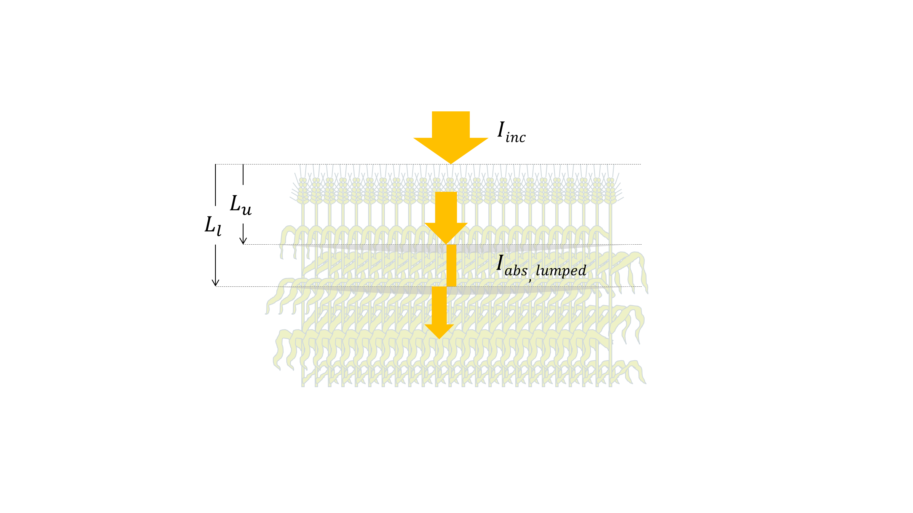
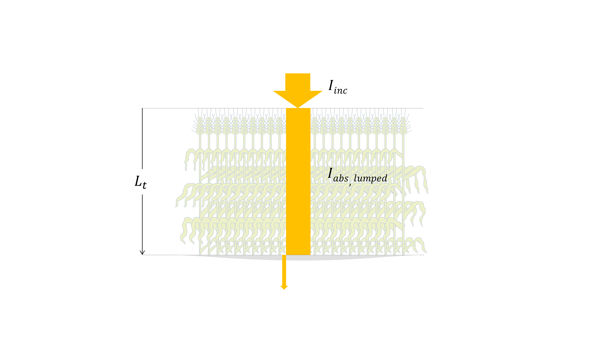

Absorbed lumped irradiance
==========================
Absorption of lumped irradiance can be calculated following two models, respectively Beer's law
**(Monsi and Saeki, 1953)** and **de Pury et al. (1997)**.

Beer's law
----------
**Monsi and Saeki (1953)** were probably the first to use Beer-Lambert's law in order to simulate irradiance transfer
through crop canopies. Following this approach, leaves are assumed to form a continuous turbid medium that intercepts the incident
irradiance :math:`I_{inc} \ [W \cdot m^{-2}_{ground}]` and the ability of the canopy to transfer irradiance is
represented by the so-called so-called extinction coefficient property
:math:`k_{lumped} \ [m^2_{ground} \cdot m^{-2}_{leaf}]`.

.. _fig_absorption_lumped:

.. figure:: figs/absorption_lumped.png
    :align: center

    *Lumped* irradiance absoption.
    :math:`L \ [m^2_{leaf} \cdot m^{-2}_{ground}]` is downward-cumulative leaf area index,
    :math:`I_{inc} \ [W \cdot m^{-2}_{ground}]` is the incident global irradiance,
    :math:`I_{trans} \ [W \cdot m^{-2}_{ground}]` is the transmitted global irradiance below :math:`L`,
    :math:`I_{abs, \ lumped} \ [W \cdot m^{-2}_{ground}]` is the absorbed *lumped* irradiance by leaves throughout
    :math:`L`.

Below a given depth :math:`L \ [m^2_{leaf} \cdot m^{-2}_{ground}]` inside the canopy, the flux density of the
transmitted irradiance :math:`I_{trans} \ [W \cdot m^{-2}_{ground}]` is calculated as:

.. math::
    :label: lumped_beer_transmitted

    I_{trans} = I_{inc} \cdot \exp \left( -k_{lumped} \cdot L \right)

Given a finite leaf layer of a thickness :math:`dL \ [m^2_{leaf} \cdot m^{-2}_{ground}]` at depth :math:`L` , the
absorbed *lumped* irradiance :math:`d I_{abs} \ [W \cdot m^{-2}_{ground}]` can be calculated as:

.. math::
    :label: lumped_beer_absorbed_finite_layer

    \frac{d I_{abs, \ lumped}}{d L} =& - \frac{d I_{trans}}{d L}  \\
                                    =&  k_{lumped} \cdot I_{inc} \cdot \exp(-k_{lumped} \cdot L)

Layered canopies
++++++++++++++++

.. _fig_absorption_lumped_layered:

    *Lumped* irradiance absoption by a leaf layer spanning between upper
    :math:`L_u [m^2_{leaf} \cdot m^{-2}_{ground}]` and lower :math:`L_l [m^2_{leaf} \cdot m^{-2}_{ground}]` depths.

The rate of the absorbed irradiance of a leaf layer that spands between an upper depth
:math:`L_u \ [m^2_{leaf} \cdot m^{-2}_{ground}]` and a lower depth :math:`L_l \ [m^2_{leaf} \cdot m^{-2}_{ground}]`
(:numref:`fig_absorption_lumped_layered`) is obtained from :eq:`lumped_beer_absorbed_finite_layer` as:

.. math::
    :label: lumped_absorbed_layer_integral

    I_{abs, \ lumped} = \int_{L_u}^{L_l} {k_{lumped} \cdot I_{inc} \cdot \exp(-k_{lumped} \cdot L) \ dL}

which yields:

.. math::
    :label: lumped_absorbed_layered

    I_{abs, \ lumped} = I_{inc} \cdot \left[ \exp(-k_{lumped} \cdot L_u) - exp(-k_{lumped} \cdot L_l) \right]

Bigleaf canopies
++++++++++++++++

.. _fig_absorption_lumped_bigleaf:

    *Lumped* irradiance absoption by a *bigleaf* canopy.
    :math:`L_t [m^2_{leaf} \cdot m^{-2}_{ground}]` is the total leaf area index.

Irradiance absorption by a *bigleaf* canopy (:numref:`fig_absorption_lumped_bigleaf`) is simply derived from
:eq:`lumped_absorbed_layered` by replacing :math:`L_u` and :math:`L_l` by 0 and the total leaf area index
:math:`L_{t} \ [m^2_{leaf} \cdot m^{-2}_{ground}]`, respectively, which yields:

.. math::
    :label: lumped_absorbed_big_leaf

    I_{abs, \ lumped} = I_{inc} \cdot \left[1 - \exp(-k_{lumped} \cdot L_t) \right]

de Pury and Farquhar (1997)
---------------------------
This model is simplified from Goudriaan models **(Goudriaan, 1977; 1988; 1994; 2016)** by disregarding the scattering
effect of leaves. **de Pury and Farquhar (1997)** calculated the absorbed lumped irradiance as the sum of absorbed
direct and diffuse irradiance rates, respectively :math:`I_{abs, \ direct}` and
:math:`I_{abs, \ diffuse} \ [W \cdot m^{-2}_{ground}]`:

.. math::
    :label: lumped_de_pury

    I_{abs, \ lumped} = I_{abs, \ direct} + I_{abs, \ diffuse}

Layered canopies
++++++++++++++++
On a ground area basis, the absorbed lumped irradiance by a leaf layer spanning between depths
:math:`L_u` and :math:`L_l \ [m^2_{leaf} \cdot m^{-2}_{ground}]` writes:

.. math::
    :label: lumped_layered_de_pury

    I_{abs, \ lumped}
        &= I_{inc, \ direct} \cdot
            (1 - \rho_{direct}) \cdot
            \left(
                \exp(-k_{direct} \cdot L_u) - \exp(-k_{direct} \cdot L_l)
            \right) \\
        &+ I_{inc, \ diffuse} \cdot
            (1 - \rho_{diffuse}) \cdot
            \left(
                \exp(-k_{diffuse} \cdot L_u) - \exp(-k_{diffuse} \cdot L_l)
            \right)

where
:math:`I_{inc, \ direct} \ [W \cdot m^{-2}_{ground}]` is the incident direct (beam) irradiance,
:math:`I_{inc, \ diffuse} \ [W \cdot m^{-2}_{ground}]` is the incident sky-diffused irradiance,
:math:`\rho_{direct} \ [-]` is canopy reflectance to direct irradiance,
:math:`\rho_{diffuse} \ [-]` is canopy reflectance to diffuse irradiance,
:math:`k_{direct} \ [m^2_{ground} \cdot m^{-2}_{leaf}]` is the extinction coefficient of the direct irradiance, and
:math:`k_{diffuse} \ [m^2_{ground} \cdot m^{-2}_{leaf}]` is the extinction coefficient of the diffuse irradiance. These
variables are thoroughly described in :doc:`_absorbed_sunlit_shaded`.

Bigleaf canopies
++++++++++++++++
For a bigleaf canopy, equation :eq:`lumped_layered_de_pury` become:

.. math::
    :label: lumped_big_leaf_de_pury

    I_{abs, \ lumped}
        &= I_{inc, \ direct} \cdot
            (1 - \rho_{direct}) \cdot
            \left(
                1 - \exp(-k_{direct} \cdot L_t)
            \right) \\
        &+ I_{inc, \ diffuse} \cdot
            (1 - \rho_{diffuse}) \cdot
            \left(
                1 - \exp(-k_{diffuse} \cdot L_t)
            \right)
