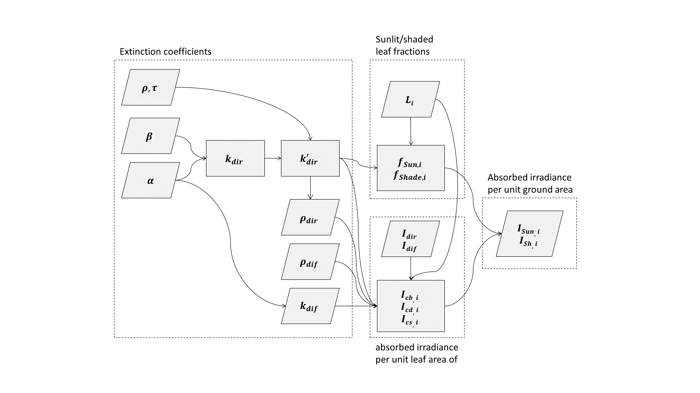

Absorbed irradiance by sunlit and shaded leaf fractions
=======================================================

.. _sunlit_shaded_flowchart:

    Flowchart of the procedure to simulate irradiance absorption by sunlit and shaded leaf surfaces per unit ground
    area.
    :math:`\rho \ [-]` and :math:`\tau \ [-]` are respectively leaf reflectance and transmittance coefficients,
    :math:`\beta \ [-]` is solar elevation,
    :math:`\alpha \ [-]` is leaf inclination,
    :math:`k^{'}_{dir} \ [m^2_{ground} \cdot m^{-2}_{leaf}]`, :math:`k_{dir} \ [m^2_{ground} \cdot m^{-2}_{leaf}]` and
    :math:`k_{dif} \ [m^2_{ground} \cdot m^{-2}_{leaf}]` are the extinction coefficients of direct, combined direct and
    scattered, and diffuse irradiance, respectively,
    :math:`\rho_{dir} \ [-]` and :math:`\rho_{dif} \ [-]` are canopy reflectance coefficients for direct and diffuse
    irradiance, respectively,
    :math:`L \ [m^{2}_{leaf} \cdot m^{-2}_{ground}]` is the downward cumulative leaf area index,
    :math:`\Delta L \ [m^{2}_{leaf} \cdot m^{-2}_{ground}]` is leaf layer thickness,
    :math:`f_{sun} \ [-]` and :math:`f_{shade} \ [-]` are leaf fractions of sunlit and shaded leaves, respectively,
    :math:`I_{inc, \ dir} \ [W \cdot m^{-2}_{ground}]` and :math:`I_{inc, \ dif} \ [W \cdot m^{-2}_{ground}]` are
    incident direct and diffuse irradiance components, respectively,
    :math:`I_{abs, \ b} \ [W \cdot m^{-2}_{leaf}]`, :math:`I_{abs, \ d} \ [W \cdot m^{-2}_{leaf}]` and
    :math:`I_{abs, \ s} \ [W \cdot m^{-2}_{leaf}]` are absorbed direct, diffuse, and combined direct and scattered irradiance
    components, respectively, finally,
    :math:`I_{abs, \ sun} \ [W \cdot m^{-2}_{ground}]` and :math:`I_{abs, \ shade} \ [W \cdot m^{-2}_{ground}]` are
    total irradiance absorbed by sunlit and shaded leaves, respectively.

The calculation procedure of absorbed direct and diffuse irradiance components is resumed as follows:

*  For each time step the solar elevation is calculated based on observer’s position and the date;
*  The solar elevation, together with sky cover, determine the flux densities of direct and diffuse irradiance
components that are incident on the top of the canopy;
*  The solar elevation determines beam and scattered beam irradiance penetration depths (when not null) inside the
canopy. The corresponding extinction coefficients are calculated on **hourly basis** for direct irradiance,
while the extinction coefficient of diffuse irradiance is assumed constant as long as the leaf area index is constant;
*  Canopy reflectance coefficients are calculated on hourly basis for direct irradiance, while reflectance coefficient
for diffuse irradiance is assumed constant;
*  Finally, absorbed irradiance by each of sunlit and shaded leaf fractions are determined on a ground area basis.

In the following sections, the calculation procedures for determining the extinction coefficients,
reflectance coefficients and absorbed irradiance per sunlit and shade leaves will be given.
The equations used therein have been developed by **Goudriaan and van Laar (1994)**.

.. toctree::
   absorbed_sunlit_shaded_extinction_coefs
   absorbed_sunlit_shaded_reflectance_coefs
   absorbed_sunlit_shaded_layered
