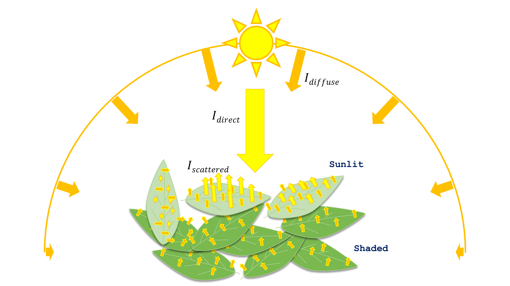
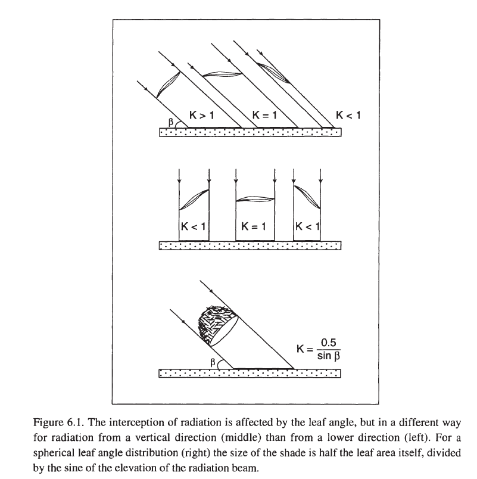
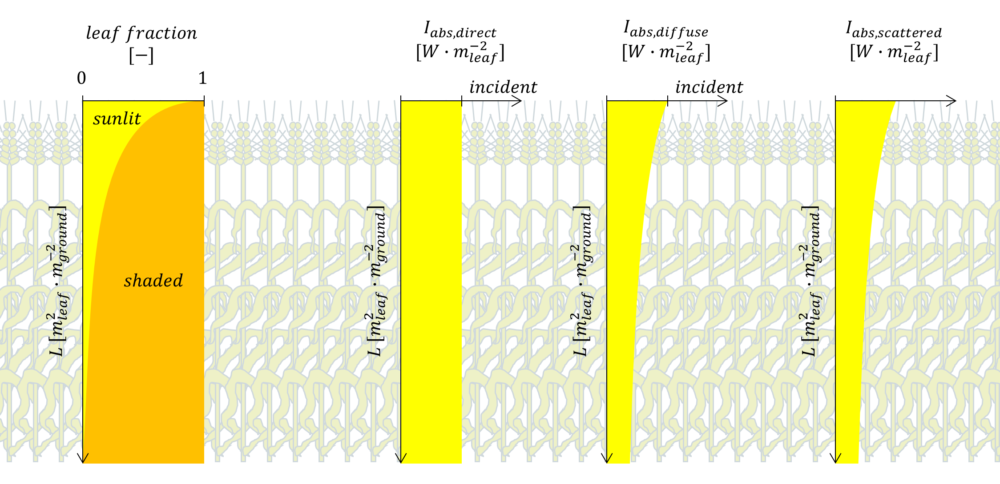

Absorbed irradiance by sunlit and shaded leaf fractions
=======================================================

Let's state first the following two assumptions that have long been used in crop models following
**Goudriaan (1977; 1988; 1994; 2016)** (:numref:`absorption_sunlit_shaded_irradiance_terms`):

1.   sunlit leaves receive solar irradiance that comes directly from the solar beam (:math:`I_{direct}`), that is diffused
by the sky/clouds (:math:`I_{diffuse}`), and that is scattered by other leaves (J. Goudriaan refers to as
"second-hand" direct irradiance, :math:`I_{scattered}`)

2.   shaded leaves do not receive the direct irradiance but do receive diffuse and scattered irradiance.

.. _absorption_sunlit_shaded_irradiance_terms:

    Irradiance components that are absorbed by sunlit and shaded leaves.
    :math:`I_{direct} \ [W \cdot m^{-2}_{ground}]` is solar direct (beam) irradiance,
    :math:`I_{diffuse} \ [W \cdot m^{-2}_{ground}]` is sky-diffused irradiance, and
    :math:`I_{scattered} \ [W \cdot m^{-2}_{ground}]` is leaf-scattered irradiance.

You may have noticed in :numref:`absorption_sunlit_shaded_irradiance_terms` that the size of the scattered yellow
arrows changes with leaf orientation. I tried by doing so to illustrate how leaf orientation affects its scattering
to the incident irradiance and by that, to indicate that also the quantity of the direct irradiance that absorbs each
leaf depends on the angle between that leaf and the solar beam. Hence, I'd also like to state that simulating
irradiance absorption by sunlit and shaded leaves depends on solar position. **Consequently, calculations must be
performed on infra-daily (typically hourly) basis.**

Ok then... how much irradiance is absorbed depends on the angle between the leaves and the sun, right? but how?!
The answer is through "extinction coefficients"! For instance, the higher the sun is in the sky, the more likely for
solar beam to reach deeper leaves inside the canopy. Furthermore, the more uniformly distributed leaf angles are, the
more irradiance they are likely to intercept (vertical leaves for instance do not absorb any irradiance at midday).
Generally, it is assumed that leaf angles through the canopy follow a uniform distribution. **This means that if we took
all leaves and organized them on a surface, this surface will be a hemisphere.** The consequence of this assumption is
that the surface of leaves that intercepts the incoming irradiance will remain the same independently of the incident
angle.

.. _leaf_angle_distribution:

    Effect of the distribution of leaf angles on the interception to solar irradiance
    (after **Goudriaan and van Laar, 1994**)

Finally, before going into equations, I'd like to make clear the 'apparently evident' difference between absorbed
irradiance flux densities per unit leaf and ground areas.

The absorbed irradiance per unit ground area is the product of, from the one hand, the absorbed irradiance per unit
leaf area and, from the other hand, leaf area fraction (sunlit and shaded) per unit ground area.

All of leaf area fractions and irradiance flux densities vary, generally, exponentially with depth, except the direct
irradiance (:numref:`absorption_sunlit_shaded_fractions_and_intensities`). To simply understand this fact, think about
sunflecks inside a canopy. All light spots shine with the same intensity, yet, the surface of these spots reduces
strongly with depth. This is the case of direct irradiance and the sunlit fraction.

.. _fig_absorption_sunlit_shaded_fractions_and_intensities:

    Leaf fractions and irradiance intensities considered for calculating irradiance absorption by *sunlit-shaded*
    canopies.
    :math:`L \ [m^2_{leaf} \cdot m^{-2}_{ground}]` is the downwards-cumulative leaf area index,
    :math:`I_{abs, \ direct} \ [W \cdot m^{-2}_{leaf}]` is flux density of the absorbed direct (solar beam) irradiance,
    :math:`I_{abs, \ diffuse} \ [W \cdot m^{-2}_{leaf}]` is flux density of the absorbed sky-diffused irradiance, and
    :math:`I_{abs, \ scattered} \ [W \cdot m^{-2}_{leaf}]` is flux density of the absorbed leaf-scattered irradiance.

.. _sunlit_shaded_flowchart:

.. figure:: figs/sunlit_shaded_flowchart.png
    :align: center

    Flowchart of the procedure to simulate irradiance absorption by sunlit and shaded leaf surfaces per unit ground
    area.
    :math:`\rho \ [-]` and :math:`\tau \ [-]` are respectively leaf reflectance and transmittance coefficients,
    :math:`\beta \ [-]` is solar elevation,
    :math:`\alpha \ [-]` is leaf inclination,
    :math:`k^{'}_{dir} \ [m^2_{ground} \cdot m^{-2}_{leaf}]`, :math:`k_{dir} \ [m^2_{ground} \cdot m^{-2}_{leaf}]` and
    :math:`k_{dif} \ [m^2_{ground} \cdot m^{-2}_{leaf}]` are the extinction coefficients of direct, combined direct and
    scattered, and diffuse irradiance, respectively,
    :math:`\rho_{dir} \ [-]` and :math:`\rho_{dif} \ [-]` are canopy reflectance coefficients for direct and diffuse
    irradiance, respectively,
    :math:`L \ [m^{2}_{leaf} \cdot m^{-2}_{ground}]` is the downward cumulative leaf area index,
    :math:`\Delta L \ [m^{2}_{leaf} \cdot m^{-2}_{ground}]` is leaf layer thickness,
    :math:`f_{sun} \ [-]` and :math:`f_{shade} \ [-]` are leaf fractions of sunlit and shaded leaves, respectively,
    :math:`I_{inc, \ dir} \ [W \cdot m^{-2}_{ground}]` and :math:`I_{inc, \ dif} \ [W \cdot m^{-2}_{ground}]` are
    incident direct and diffuse irradiance components, respectively,
    :math:`I_{abs, \ b} \ [W \cdot m^{-2}_{leaf}]`, :math:`I_{abs, \ d} \ [W \cdot m^{-2}_{leaf}]` and
    :math:`I_{abs, \ s} \ [W \cdot m^{-2}_{leaf}]` are absorbed direct, diffuse, and combined direct and scattered irradiance
    components, respectively, finally,
    :math:`I_{abs, \ sun} \ [W \cdot m^{-2}_{ground}]` and :math:`I_{abs, \ shade} \ [W \cdot m^{-2}_{ground}]` are
    total irradiance absorbed by sunlit and shaded leaves, respectively.

The calculation procedure of absorbed direct and diffuse irradiance components is resumed as follows:

*  For each time step the solar elevation is calculated based on observer’s position and the date;
*  The solar elevation, together with sky cover, determine the flux densities of direct and diffuse irradiance
components that are incident on the top of the canopy;
*  The solar elevation determines beam and scattered beam irradiance penetration depths (when not null) inside the
canopy. The corresponding extinction coefficients are calculated on **hourly basis** for direct irradiance,
while the extinction coefficient of diffuse irradiance is assumed constant as long as the leaf area index is constant;
*  Canopy reflectance coefficients are calculated on hourly basis for direct irradiance, while reflectance coefficient
for diffuse irradiance is assumed constant;
*  Finally, absorbed irradiance by each of sunlit and shaded leaf fractions are determined on a ground area basis.

In the following sections, the calculation procedures for determining the extinction coefficients,
reflectance coefficients and absorbed irradiance per sunlit and shade leaves will be given.
The equations used therein have been developed by **Goudriaan and van Laar (1994)**.

.. toctree::
   absorbed_sunlit_shaded_extinction_coefs
   absorbed_sunlit_shaded_reflectance_coefs
   absorbed_sunlit_shaded_layered
