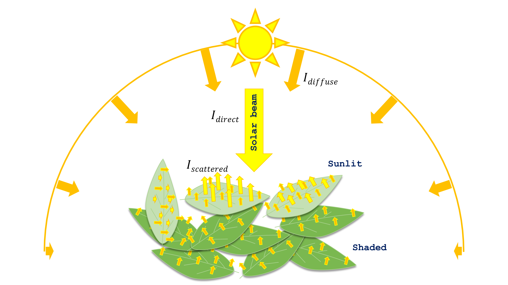
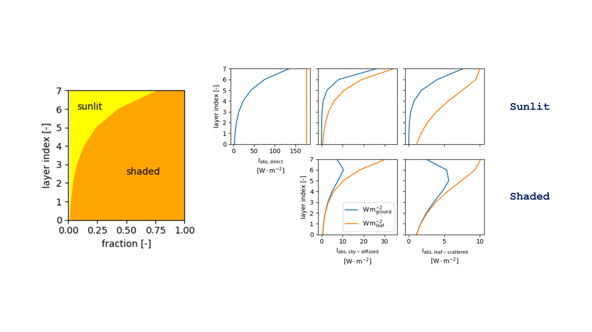

Absorbed irradiance by sunlit and shaded leaf fractions
=======================================================

Let's state first the following two assumptions **(Goudriaan, 1977; 1988; 1994; 2016**):

#. | sunlit leaves receive solar irradiance that comes directly from the solar beam (:math:`I_{direct}`),
   | irradiance that is diffused by the sky/clouds (:math:`I_{diffuse}`), and that is scattered by other leaves
   | (J. Goudriaan refers to as "second-hand" direct irradiance, :math:`I_{scattered}`).

#. shaded leaves do not receive the direct irradiance but do receive diffuse and scattered irradiance.

.. _absorption_sunlit_shaded_irradiance_terms:

    Irradiance components that are absorbed by sunlit and shaded leaves.
    :math:`I_{direct} \ [W \cdot m^{-2}_{leaf}]` is solar direct (beam) irradiance,
    :math:`I_{diffuse} \ [W \cdot m^{-2}_{leaf}]` is sky-diffused irradiance, and
    :math:`I_{scattered} \ [W \cdot m^{-2}_{leaf}]` is leaf-scattered irradiance.

You may have noticed in :numref:`absorption_sunlit_shaded_irradiance_terms` that the size of the scattered yellow
arrows changes with leaf orientation. I tried by doing so to illustrate how leaf orientation affects its scattering
to the incident irradiance and by that, to indicate that also the quantity of the direct irradiance absorbed by a given
leaf depends on the angle between that leaf and the solar beam. That is, in order to calculate irradiance absorption
by sunlit and shaded we need to know the solar position.
**Consequently, calculations must be performed on infra-daily (typically hourly) basis.**

Ok, so how much irradiance is absorbed depends on the angle between the leaves and the sun, but how?!
The answer is through "extinction coefficients"! For instance, the higher the sun is in the sky, the more likely for
solar beam to reach deeper leaves inside the canopy. Furthermore, the more uniformly distributed leaf angles are, the
more irradiance they are likely to intercept irradiance.
Generally, it is assumed that leaf angles through the canopy follow a uniform distribution. **This means that if we took
all leaves and organized them on a surface, this surface will be a hemisphere.** The consequence of this assumption is
that the surface of leaves that intercepts the incoming irradiance will remain the same independently from the incident
angle (:numref:`leaf_angle_distribution`).

.. _leaf_angle_distribution:

.. figure:: figs/leaf_angles_distribution.png
    :align: center

    Effect of the distribution of leaf angles on the interception to solar irradiance
    (after **Goudriaan and van Laar, 1994**). :math:`\beta \ [-]` is the angle of the solar elevation.

Finally, before going into equations, recall that the absorbed irradiance per unit ground area is the product of the
absorbed irradiance per unit leaf area and leaf area index (leaf area per unit ground area) for each leaf fraction
(sunlit and shaded). Keep in mind also that at the exception of the flux density of direct irradiance
(:math:`I_{direct} \ [W \cdot m^{-2}{leaf}]`), leaf area fractions and irradiance flux densities vary
exponentially with depth (:numref:`fig_absorption_sunlit_shaded_fractions_and_intensities`).
:math:`I_{direct}` is constant with depth. To simply understand this fact, check sunflecks inside a canopy:
all light spots shine with the same intensity, yet, the surface of these spots reduces
strongly with depth (:numref:`fig_sunlit_fraction_profile`).

.. _fig_absorption_sunlit_shaded_fractions_and_intensities:

    Leaf fractions and irradiance intensities considered for calculating irradiance absorption by *sunlit-shaded*
    canopies.
    :math:`L \ [m^2_{leaf} \cdot m^{-2}_{ground}]` is the downwards-cumulative leaf area index,
    :math:`I_{abs, \ direct} \ [W \cdot m^{-2}_{leaf}]` is flux density of the absorbed direct (solar beam) irradiance,
    :math:`I_{abs, \ diffuse} \ [W \cdot m^{-2}_{leaf}]` is flux density of the absorbed sky-diffused irradiance, and
    :math:`I_{abs, \ scattered} \ [W \cdot m^{-2}_{leaf}]` is flux density of the absorbed leaf-scattered irradiance.

.. _fig_sunlit_fraction_profile:

.. figure:: figs/sunlit_fraction_profile.png
    :align: center

    The surface of sunlit leaves, not light intensity, reduces stringly with depth inside the canopy from
    upper :math:`(a)` to lower :math:`(b)` levels.

Steps for calculating irradiance absorption
-------------------------------------------

The procedure for calculating irradiance absorption by sunlit and shaded leaves is summarized in the following steps:

#. | Given solar elevation and direct and sky-diffused solar irradiance at a given hourFor each time step the solar elevation is calculated based on observer’s position and date.

#. | The solar elevation, together with sky cover, determine the flux densities of direct and diffuse irradiance
   | components that are incident on the top of the canopy.

#. | The solar elevation determines beam and scattered beam irradiance penetration depths (when not null) inside the
   | canopy. The corresponding extinction coefficients are calculated on **hourly basis** for direct irradiance,
   | while the extinction coefficient of diffuse irradiance is assumed constant as long as the leaf area index is constant.

#. | Canopy reflectance coefficients are calculated on hourly basis for direct irradiance, while reflectance coefficient
   | for diffuse irradiance is assumed constant.

#. | Finally, absorbed irradiance by each of sunlit and shaded leaf fractions are determined on a ground area basis.

In the following sections, the calculation procedures for determining the extinction coefficients,
reflectance coefficients and absorbed irradiance per sunlit and shade leaves will be given.
The equations used therein have been developed by **Goudriaan and van Laar (1994)**.

.. _sunlit_shaded_flowchart:

.. figure:: figs/sunlit_shaded_flowchart.png
    :align: center

    Flowchart of the procedure to simulate irradiance absorption by sunlit and shaded leaf surfaces per unit ground
    area.
    :math:`\rho \ [-]` and :math:`\tau \ [-]` are respectively leaf reflectance and transmittance coefficients,
    :math:`\beta \ [-]` is solar elevation,
    :math:`\alpha \ [-]` is leaf inclination,
    :math:`k^{'}_{dir} \ [m^2_{ground} \cdot m^{-2}_{leaf}]`, :math:`k_{dir} \ [m^2_{ground} \cdot m^{-2}_{leaf}]` and
    :math:`k_{dif} \ [m^2_{ground} \cdot m^{-2}_{leaf}]` are the extinction coefficients of direct, combined direct and
    scattered, and diffuse irradiance, respectively,
    :math:`\rho_{dir} \ [-]` and :math:`\rho_{dif} \ [-]` are canopy reflectance coefficients for direct and diffuse
    irradiance, respectively,
    :math:`L \ [m^{2}_{leaf} \cdot m^{-2}_{ground}]` is the downward cumulative leaf area index,
    :math:`\Delta L \ [m^{2}_{leaf} \cdot m^{-2}_{ground}]` is leaf layer thickness,
    :math:`f_{sun} \ [-]` and :math:`f_{shade} \ [-]` are leaf fractions of sunlit and shaded leaves, respectively,
    :math:`I_{inc, \ dir} \ [W \cdot m^{-2}_{ground}]` and :math:`I_{inc, \ dif} \ [W \cdot m^{-2}_{ground}]` are
    incident direct and diffuse irradiance components, respectively,
    :math:`I_{abs, \ b} \ [W \cdot m^{-2}_{leaf}]`, :math:`I_{abs, \ d} \ [W \cdot m^{-2}_{leaf}]` and
    :math:`I_{abs, \ s} \ [W \cdot m^{-2}_{leaf}]` are absorbed direct, diffuse, and combined direct and scattered irradiance
    components, respectively, finally,
    :math:`I_{abs, \ sun} \ [W \cdot m^{-2}_{ground}]` and :math:`I_{abs, \ shade} \ [W \cdot m^{-2}_{ground}]` are
    total irradiance absorbed by sunlit and shaded leaves, respectively.

Extinction coefficients of irradiance components
------------------------------------------------

The incident direct (:math:`I_{inc, \ direct}`) and sky-diffused (:math:`I_{inc, \ diffuse}`) irradiacne fluxes have
distinct extinction coefficients inside the canopy.

The extinction coefficient of the direct irradiance (:math:`k_{direct} \ [m^2_{ground} \cdot m^{-2}_{leaf}]`) varies
within the day as a function of the position of the sun (recall that the higher the sun is, the deeper sunflcks go
inside the canopy). Assuming a spherical leaf angles distribution (cf. :doc:`absorbed_sunlit_shaded`),
:math:`k_{direct}` writes **(Cowan, 1968; Goudriaan, 1977)**:

.. math::
    :label: direct_extinction_coefficient

    k_{direct} = k_{direct, \ black} \cdot \sqrt{1 - \sigma}

with

.. math::
    :label: direct_black_extinction_coefficient

    k_{direct, \ black} = \frac{0.5}{\sin{\beta}}

where
:math:`k_{direct, \ black} \ [m^2_{ground} \cdot m^{-2}_{leaf}]` is the extinction coefficient of black leaves and
:math:`\sigma \ [-]` is the leaf scattering coefficient, equal to the sum of leaf reflectance and transmittance,
all in the same irradiance band:

.. math::
    :label: scattering_coefficient

    \sigma = \rho + \tau

The extinction coefficient of the sky-diffused irradiance (:math:`k_{diffuse} \ [m^2_{ground} \cdot m^{-2}_{leaf}]`)
is independent from sun's position but varies with the total leaf area of the canopy.
:math:`k_{diffuse}` is derived using :eq:`direct_extinction_coefficient` by considering the sky as an ensemble of
finite sectors that send, each, diffuse irradiance as if it were a beam irradiance. These sectors may be represented by
rings. The extinction coefficient :math:`k_{diffuse}` is given as:

.. math::
    :labe: diffuse_extinction_coefficient_general
    k_{diffuse} = - \frac{1}{L_t} \cdot \ln
                        \left(
                            \Sigma_i^n {c_i \cdot e^\left( {- \frac{0.5}{\sin \beta_{sky, \ i} \cdot \sqrt{1 - \sigma}} \cdot L_t \right)}
                        \left)

where
:math:`L_t \ [m^2_{leaf} \ m^{-2}_{ground}]` is the canopy total leaf area index,
:math:`\beta_{sky, \ i} \ [-]` is the angle elevation of each sky ring,
:math:`c_i \ [-]` is a weighing factor accounting for the relative surface area of each sky ring, and
:math:`n \ [-]` is the number of sky rings that form the sky dome.

**Goudriaan (1988)** showed that :math:`k_{diffuse}` can be adequately estimated as long as the number of sky rings is
greater or equal to 3. Thus for 3 rings spanning respectively over angular sectors with an increasing angle of
30 :math:`^\circ`
(:math:`\left[ 0, \frac{\pi}{6} \right]`,
:math:`\left[ \frac{\pi}{6}, \frac{\pi}{3} \right]`,
:math:`\left[ \frac{\pi}{3}, \frac{\pi}{2} \right]`)
the last equation becomes:

.. math::
    :label: diffuse_extinction_coefficient

    k_{diffuse} = - \frac{1}{L_t} \cdot \ln
                        \left(
                            0.178 \cdot e^ {-\frac{0.5}{\sin (\frac{\pi}{12})} \cdot \sqrt{1 - \sigma} \cdot L_t}
                            + 0.514 \cdot e^ {-\frac{0.5}{\sin (\frac{3\pi}{12})} \cdot \sqrt{1 - \sigma} \cdot L_t}
                            + 0.308 \cdot e^ {-\frac{0.5}{\sin (\frac{5\pi}{12})} \cdot \sqrt{1 - \sigma} \cdot L_t}
                        \right)

where
the coefficients 0.178, 0.514 and 0.308 are calculated for a standard sky over cast (SOC) assuming a ration 3:1
between zenith and minimum horizontal sky illuminance.

Reflectance coefficients of irradiance components
-------------------------------------------------

Canopy reflectance to direct irradiance :math:`\rho_{direct} \ [-]` depends on leaf angles distribution and the
declination of the solar beam. :math:`\rho_{direct}` is lowest when the sun is closest the zenith and highest as solar inclination
approaches 0 :math:`^\circ` (sun is grazing over horizontal leaves). :math:`\rho_{dir}` is given by **Goudriaan (1977)**
as:

.. math::
    :label: direct_canopy_reflectance

    \rho_{direct} = 1 - \exp {\left( - \frac{2 \cdot \rho_h \cdot k_{direct, \ black}}{1 + k_{direct, \ black}} \right)}

where :math:`\rho_h \ [-]` is the reflection coefficient of a canopy having horizontal leaves, defined as:

.. math::
    :label: horizontal_reflectance

    \rho_h = \frac{1 - \sqrt{1 - \sigma}}{1 + \sqrt{1 - \sigma}}

Canopy reflectance coefficient to the sky-diffused irradiance
(:math:`\rho_{diffuse} \ [m^2_{ground} \cdot m^{-2}_{leaf}]`) is farely constant across canopies and its value can
roughly be set to 0.057 for the photosynthetically active radiation (PAR) band and 0.389 for the near infrared (NIR)
band **(Goudriaan and van Laar, 1994)**.

Irradiance absorption
---------------------

Let's recall first that sunlit leaves absorbe irradiance that comes from the
solar beam (:math:`I_{abs, \ direct} \ [W \cdot m^{-2}_{leaf}]`),
sky-diffused (:math:`I_{abs, \ sky-diffused} \ [W \cdot m^{-2}_{leaf}]`), and
leaf-scattered (:math:`I_{abs, \ leaf-scattered} \ [W \cdot m^{-2}_{leaf}]`) irradiance.
Shaded leaves receive only sky-diffused and leaf-scattered irradiance (cf. :doc:`absorbed_sunlit_shaded`).

On a ground area basis, irradiance absorption by sunlit :math:`I_{abs, \ sunlit} \ [W \cdot m^{-2}_{ground}]`
and shaded :math:`I_{abs, \ shaded} \ [W \cdot m^{-2}_{ground}]` leaf fractions of a leaf layer spanning between depths
:math:`L_u \ [m^2_{leaf} \cdot m^{-2}_{ground}]` and :math:`L_l \ [m^2_{leaf} \cdot m^{-2}_{ground}]` are given as:

.. math::
    :label: sunlit_absorbed

    I_{abs, \ sunlit} =
        \int_{L_u}^{L_l} {
            \left(
                I_{abs, \ direct} + I_{abs, \ sky-diffused} + I_{abs, \ leaf-scattered}
            \right) \cdot \phi_{sunlit} \ dL
        }

.. math::
    :label: shaded_absorbed

    I_{abs, \ sunlit} =
        \int_{L_u}^{L_l} {
            \left(
                I_{abs, \ sky-diffused} + I_{abs, \ leaf-scattered}
            \right) \cdot \phi_{shaded} \ dL
        }

where
:math:`\phi_{sunlit} \ [m^2_{leaf} \cdot m^{-2}_{leaf}]` and :math:`\phi_{shaded} \ [m^2_{leaf} \cdot m^{-2}_{leaf}]`
are respectively leaf fractions of sunlit and shaded leaves, given as:

.. math::
    :label: sunlit_fraction_leaf_basis

    \phi_{sunlit} = e ^ {- k_{direct, \ black} \cdot L}

.. math::
    :label: shaded_fraction_leaf_basis

    \phi_{shaded} = 1 - \phi_{sunlit}

:math:`I_{abs, \ direct}`, :math:`I_{abs, \ sky-diffused}` and :math:`I_{abs, \ leaf-scattered}` are given in the three
following equations, respectively:

.. math::
    :label: beam_diffuse_scattered_absorbed

    \begin{array}

        I_{abs, \ direct} &=
            I_{inc, \ direct} \cdot (1 - \sigma) \cdot k_{direct, \ black}
        \\
        I_{abs, \ sky-diffused} &=
            I_{inc, \ diffuse} \cdot
            \left( 1 - \rho_{diffuse} \right) \cdot
            k_{diffuse} \cdot
            e ^ {- k_{diffuse} \cdot L }
        \\
        I_{abs, \ leaf_scattered} &=
            I_{inc, \ direct} \cdot
            \left[
                \begin{array}
                    (1 - \rho_{direct}) \cdot k_{direct} e ^ {(-k_{diffuse} \cdot L)} \\
                    - (1 - \sigma) \cdot k_{direct, \ black} \cdot e ^ {(-k_{direct, \ black} \cdot L)}
                \end{array}
            \right]

    \end{array}

where
:math:`I_{inc, \ direct}` and
:math:`I_{inc, \ diffuse} \ [W \ m^{-2}_{ground}]` are the incident direct and sky-diffused irradiance, respectively.

Layered canopies
----------------

For a leaf layer spanning between depths :math:`L_u \ [m^2_{leaf} \cdot m^{-2}_{ground}]` and
:math:`L_l \ [m^2_{leaf} \cdot m^{-2}_{ground}]` equations :eq:`sunlit_absorbed` and :eq:`shaded_absorbed` become:

.. math::
    :label: sunlit_absorbed_layered

    I_{abs, \ sunlit}
        & =
        I_{inc, \ direct} \cdot (1 - \sigma) \cdot
        \left(
            e ^ {- k_{direct, \ black} \cdot L_u} - e ^ {- k_{direct, \ black} \cdot L_l}
        \right)
        \\
        & + I_{inc, \ diffuse} \cdot
        \left( 1 - \rho_{diffuse} \right) \cdot
        \frac{k_{diffuse}}{k_{diffuse} + k_{direct, \ black}} \cdot
        \left(
            \begin{array}
                + e ^ {- (k_{diffuse} + k_{direct, \ black}) \cdot L_u } \\
                - e ^ {- (k_{diffuse} + k_{direct, \ black}) \cdot L_l }
            \end{array}
        \right)
        \\
        & + I_{inc, \ direct} \cdot
        \left[
            \begin{array}{1}
                \left( 1 - \rho_{direct} \right) \cdot
                \frac{k_{direct}}{k_{direct} + k_{direct, \ black}} \cdot
                \left(
                    \begin{array}
                        + e ^ {- (k_{direct} + k_{direct, \ black}) \cdot L_u }    \\
                        - e ^ {- (k_{direct} + k_{direct, \ black}) \cdot L_l }
                    \end{array}
                \right)
                \\
                - (1 - \sigma) \cdot
                \frac{1}{2} \cdot
                \left(
                    e ^ {- 2 \cdot k_{direct, \ black} \cdot L_u }
                    - e ^ {-2 \cdot k_{direct, \ black} \cdot L_l }
                \right)
            \end{array}
        \right]

.. math::
    :label: shaded_absorbed_layered

    I_{abs, \ shaded}
        & =
        I_{inc, \ diffuse} \cdot
        \left( 1 - \rho_{diffuse} \right) \cdot
        \left(
            \begin{array}{1}
                \left(
                    \begin{array}
                        + e ^ {- k_{diffuse} \cdot L_u } \\
                        - e ^ {- k_{diffuse} \cdot L_l }
                    \end{array}
                \right)
                \\
                - \frac{k_{diffuse}}{k_{diffuse} + k_{direct, \ black}} \cdot
                \left(
                    \begin{array}
                        + e ^ {- (k_{diffuse} + k_{direct, \ black}) \cdot L_u } \\
                        - e ^ {- (k_{diffuse} + k_{direct, \ black}) \cdot L_l }
                    \end{array}
                \right)
            \end{array}
        \right)
        \\
        & + I_{inc, \ direct} \cdot
        \left[
            \begin{array}{1}
                \left( 1 - \rho_{direct} \right) \cdot
                \left(
                    \begin{array}{1}
                        \left(
                            \begin{array}
                                + e ^ {- k_{direct} \cdot L_u }    \\
                                - e ^ {- k_{direct} \cdot L_l }
                            \end{array}
                        \right)
                        \\
                        - \frac{k_{direct}}{k_{direct} + k_{direct, \ black}} \cdot
                        \left(
                            \begin{array}
                                + e ^ {- (k_{direct} + k_{direct, \ black}) \cdot L_u }    \\
                                - e ^ {- (k_{direct} + k_{direct, \ black}) \cdot L_l }
                            \end{array}
                        \right)
                    \end{array}
                \right)
                \\
                - (1 - \sigma) \cdot
                \left(
                    \begin{array}{1}
                        \left(
                            e ^ {- k_{direct, \ black} \cdot L_u } - e ^ {- k_{direct, \ black} \cdot L_l }
                        \right)
                        \\
                        - \frac{1}{2} \cdot
                        \left(
                            e ^ {- 2 \cdot k_{direct, \ black} \cdot L_u }
                            - e ^ {-2 \cdot k_{direct, \ black} \cdot L_l }
                        \right)
                    \end{array}
                \right)
            \end{array}
        \right]

Bigleaf canopies
----------------
For a bigleaf canopy equations :eq:`sunlit_absorbed_layered` and :eq:`shaded_absorbed_layered` become respectively:

.. math::
    :label: sunlit_absorbed_bigleaf

    I_{abs, \ sunlit}
        & =
        I_{inc, \ direct} \cdot (1 - \sigma) \cdot
        \left(
            1 - e ^ {- k_{direct, \ black} \cdot L_t}
        \right)
        \\
        & + I_{inc, \ diffuse} \cdot
        \left( 1 - \rho_{diffuse} \right) \cdot
        \frac{k_{diffuse}}{k_{diffuse} + k_{direct, \ black}} \cdot
        \left(
            \begin{array}
                + 1
                - e ^ {- (k_{diffuse} + k_{direct, \ black}) \cdot L_t }
            \end{array}
        \right)
        \\
        & + I_{inc, \ direct} \cdot
        \left[
            \begin{array}{1}
                \left( 1 - \rho_{direct} \right) \cdot
                \frac{k_{direct}}{k_{direct} + k_{direct, \ black}} \cdot
                \left(
                    \begin{array}
                        + 1
                        - e ^ {- (k_{direct} + k_{direct, \ black}) \cdot L_t }
                    \end{array}
                \right)
                \\
                - (1 - \sigma) \cdot
                \frac{1}{2} \cdot
                \left(
                    1
                    - e ^ {-2 \cdot k_{direct, \ black} \cdot L_t }
                \right)
            \end{array}
        \right]

.. math::
    :label: shaded_absorbed_bigleaf

    I_{abs, \ shaded}
        & =
        I_{inc, \ diffuse} \cdot
        \left( 1 - \rho_{diffuse} \right) \cdot
        \left(
            \begin{array}{1}
                \left(
                    \begin{array}
                        + 1
                        - e ^ {- k_{diffuse} \cdot L_t }
                    \end{array}
                \right)
                \\
                - \frac{k_{diffuse}}{k_{diffuse} + k_{direct, \ black}} \cdot
                \left(
                    \begin{array}
                        + 1
                        - e ^ {- (k_{diffuse} + k_{direct, \ black}) \cdot L_t }
                    \end{array}
                \right)
            \end{array}
        \right)
        \\
        & + I_{inc, \ direct} \cdot
        \left[
            \begin{array}{1}
                \left( 1 - \rho_{direct} \right) \cdot
                \left(
                    \begin{array}{1}
                        \left(
                            \begin{array}
                                + 1
                                - e ^ {- k_{direct} \cdot L_t }
                            \end{array}
                        \right)
                        \\
                        - \frac{k_{direct}}{k_{direct} + k_{direct, \ black}} \cdot
                        \left(
                            \begin{array}
                                + 1
                                - e ^ {- (k_{direct} + k_{direct, \ black}) \cdot L_t }
                            \end{array}
                        \right)
                    \end{array}
                \right)
                \\
                - (1 - \sigma) \cdot
                \left(
                    \begin{array}{1}
                        \left(
                            1
                            - e ^ {- k_{direct, \ black} \cdot L_t }
                        \right)
                        \\
                        - \frac{1}{2} \cdot
                        \left(
                            1
                            - e ^ {-2 \cdot k_{direct, \ black} \cdot L_t }
                        \right)
                    \end{array}
                \right)
            \end{array}
        \right]
