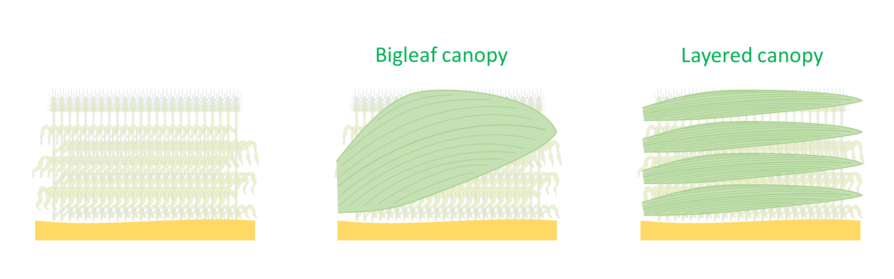

Uniform crops
=============

In this document, you'll get a cross some 'bigleaf' or 'layered' canopies, as well as some 'lumped' and 'sunlit' and
'shaded' leaf fractions... Therefore, before going further in the equations, let's give first some useful definitions.

Bigleaf and layered canopies
----------------------------
If we consider the canopy of a uniform crop (e.g. wheat, :numref:`bigleaf_vs_layered` - left), simply,
a "bigleaf" canopy is a canopy that is conceptualized as if it were a one big leaf
(:numref:`bigleaf_vs_layered` - center). In contrast, a "layered" canopy is a canopy that is represented by a seccession
of superposed leaf layers (:numref:`bigleaf_vs_layered` - right).

.. _bigleaf_vs_layered:

    Illustration of how a crop canopy may be represented following *bigleaf* and *layered* structures.

Lumped, sunlit and shaded leaf fractions
----------------------------------------
We call an irradiance absorption 'lumped' when no distinction is made between the abso

.. toctree::
   :caption: Contents:

   absorbed_lumped
   absorbed_sunlit_shaded