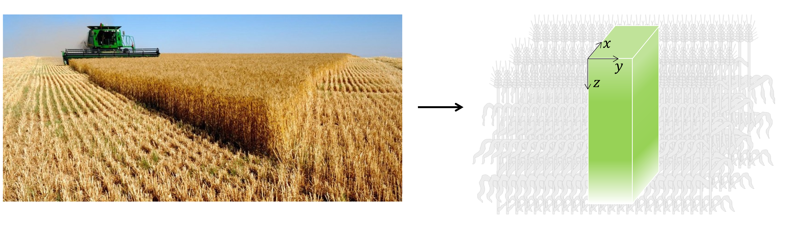
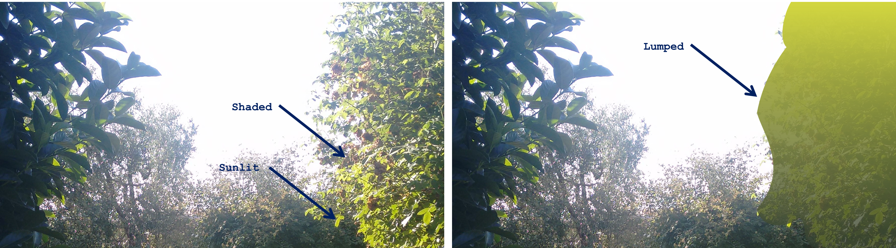

Uniform crops
=============

You'll get across this document some `bigleaf` or `layered` canopies, as well as some `lumped` and
`sunlit` and `shaded` leaf fractions... So let's clarify first what all of this is about.

Bigleaf and layered canopies
----------------------------

.. _uniform_crops:

    Wheat as an example of a crop having horizontally-uniform canopy. The prism represents leaf area variation across
    :math:`x`, :math:`y` and :math:`z` axis.

Crops such as wheat have canopies that vary weakly horizontally (:numref:`uniform_crops`, left) and may hence be
assumed uniform on the horizontal basis whereby the only change in leaf area is assumed to occur over the vertical axis
(:numref:`uniform_crops`, right).

In some cases, the vertical variability of leaf area is not of big concern the modelers. For these cases, the canopy is
presented as it where a *bigleaf* (:numref:`bigleaf_vs_layered` - center). In contrast, when the vertical variability
in leaf area matters, crop canopies are represented as a succession of leaf layers
(:numref:`bigleaf_vs_layered` - right), that's when we use the term *layered* canopy.

.. _bigleaf_vs_layered:

.. figure:: figs/bigleaf_vs_layered.png
    :align: center

    Illustration of how a crop canopy may be represented following *bigleaf* and *layered* structures.

Sunlit-shaded and lumped canopies
---------------------------------
.. _lumped_vs_sunlit_shaded_picture:

    Example of sunlit, shaded and lumped leaves.

With a crop canopy, there are leaves that are subject to the direct (beam) solar irradiance, that are called *sunlit*,
while there are leaves that are casted by those `sunlit` leaves, that are called `shaded`
(:numref:`lumped_vs_sunlit_shaded_picture`, left).

In some cases, crop modelers are interested in distinguishing between these two leaf categories. This is particularly
the case when photosynthesis is simulated over an hourly basis (take a look at **de Pury and Farquhar (1997)** for
example). Therefore, henceforth, we call a canopy *sunlit-shaded* when the latter leaf categories (or fractions) are
explicitly accounted for when simulating irradiance absorption by that canopy. In contrast, a canopy is called *lumped*,
when no distinction is made between its leaf fractions.

.. _possible_canopy_representations:

.. figure:: figs/possible_canopy_representations.png
    :align: center

    The 4 possible uniform canopy representations considered in our package.

Combining the leaf scale (*bigleaf* vs *layered*) and the leaf fraction (*sunlit-shaded* vs *lumped*) we obtain 4
possible canopy representations as illustrated in :numref:`possible_canopy_representations`.

Calculating irradiance absorption
---------------------------------

.. toctree::

   absorbed_lumped
   absorbed_sunlit_shaded